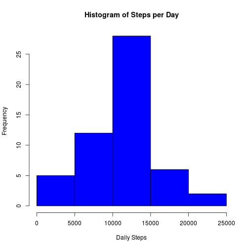
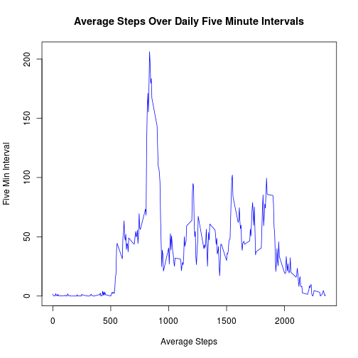
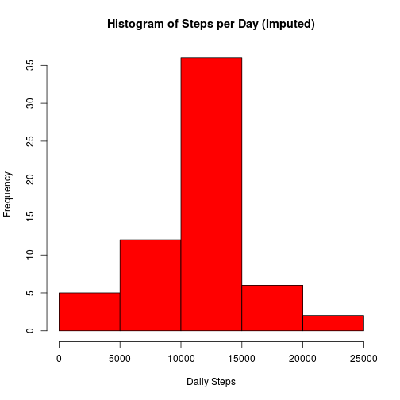
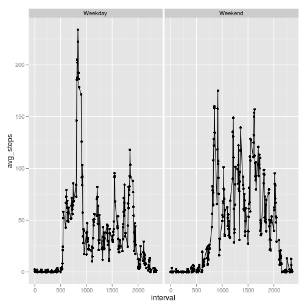

##Loading and preprocessing the data
Pedometer activity data is downloaded from a url and the csv is read into data frame


```r
# Download and read activity csv
download.file("https://d396qusza40orc.cloudfront.net/repdata%2Fdata%2Factivity.zip", "activity.zip", method="curl")
unzip("activity.zip")
act <- read.csv("activity.csv")
```


## What is mean total number of steps taken per day?
To explore the tendencies of the daily number of steps a histogram of the number of
days is plotted, showing the distribution of daily steps. 


```r
#Create subset of steps summed for each day, aggregate function used to sum over dates
day_steps <- aggregate(act$steps, by=list(act$date), FUN= sum)
names(day_steps) <- c("date", "total_steps")
hist(day_steps$total_steps, xlab="Daily Steps", main = "Histogram of Steps per Day", col="blue")
```

 


```r
mean_steps <-  as.integer(mean(day_steps$total_steps, na.rm=TRUE))
median_steps <- median(day_steps$total_steps, na.rm=TRUE)
```

The mean integer of steps per day is 10766.
The median number of steps in the dataset is 10765.


## What is the average daily activity pattern?
Judging from the pattern of steps occuring mostly in the early to middle intervals it seems likely that the subject wearing the activity tracker lives a generally diurnal lifestyle.  Given the peak seen in the early intervals we may speculate that a morning routine of exercise is sometimes observed.


```r
#Create subset of steps averaged for each interval, aggregate function used 
#to average steps over intervals
interval_steps <- aggregate(act$steps, by=list(act$interval), FUN= mean, na.rm=TRUE)
names(interval_steps) <- c("interval", "avg_steps")
plot(interval_steps$interval, interval_steps$avg_steps, type="l", col = "blue", 
    main = "Average Steps Over Daily Five Minute Intervals", xlab="Average Steps", ylab="Five Min Interval")
```

 


The following occurence includes the maximum number of steps in the dataset:

```r
# Determine which interval has the maximum average number of steps
interval_steps[interval_steps$avg_steps == max(interval_steps$avg_steps, na.rm=TRUE),] 
```

```
##     interval avg_steps
## 104      835  206.1698
```


## Imputing missing values
###Missing values incidence

```r
#Calculate and report the total number of missing values in the dataset (i.e. the total number of rows with NAs)
missing <- sum(is.na(act$steps))
total <- length(act$steps)
miss_pct <- round((missing/total)*100, digits=2)
```
There are a total of 2304 (non-zero) step measurements within the dataset.  Out of the total 17568 observations this represents a 13.11% missing values rate.


###Step imputation
In order to handle missing values I've taken the simple approach of applying the average number of steps for each interval to any date and interval combination missing data.  While this ignores some known or potential relationships like sleeping hours or weekend behavior shifts this approach the simplicity of implementation makes this approach attractive.


```r
# Devise a strategy for filling in all of the missing values in the dataset. 
# The strategy does not need to be sophisticated. For example, 
# you could use the mean/median for that day, 
# or the mean for that 5-minute interval, etc.

#Fill in missing values using average five minute interval
act_imp <- merge(act, interval_steps, sort=FALSE)
act_imp <- act_imp[order(act_imp$date, act_imp$interval, na.last=FALSE),]
act_imp$imp_steps <- as.integer(with(act_imp,ifelse(is.na(steps),avg_steps,steps)))
```


###Explore imputed step disribution
To test the imputed data I've included a histogram of the imputed step frequencies per day.  The overall distribution looks very similar to the initial histogram of the un-imputed dataset.

```r
imp_day_steps <- aggregate(act_imp$imp_steps, by=list(act_imp$date), FUN= sum)
names(imp_day_steps) <- c("date", "total_steps")
hist(imp_day_steps$total_steps, xlab="Daily Steps", main = "Histogram of Steps per Day (Imputed)", col="red")
```

 

```r
#Mean and median total steps per day
mean_impsteps <- as.integer(mean(imp_day_steps$total_steps, na.rm=TRUE))
median_impsteps <- median(imp_day_steps$total_steps, na.rm=TRUE)
```
Both the mean and median imputed number steps of steps per day are higher than the initial data.  A mean of 10749 for the imputed steps is slightly higher than that of the raw data, 10766.  The median of the imputed steps, 10641 is some -124 higher than that of the un-imputed data.


## Are there differences in activity patterns between weekdays and weekends?
To test for an obvious difference in activity between weekdays and weekends I've added a new variable to the dataset, "weekend", this variable is a two level factor with values "Weekday" and "Weekend".  Similar to the intraday activity analysis above, line charts are plotted containing the number of steps per interval, averaged for each day.  These plots, using the imputed dataset, seperately compare the intraday activity for both the weekday and weekend groups.


```r
library(ggplot2)
#Create weekend variable to store day type
 act_imp$weekend <- as.factor(ifelse(weekdays(as.Date(act_imp$date)) %in%c("Saturday", "Sunday"),
        "Weekend", "Weekday"))
weekday_intervals <- aggregate(act_imp$steps, by=list(act_imp$weekend, act_imp$interval), FUN= mean, na.rm=TRUE)
names(weekday_intervals) <- c("weekend","interval", "avg_steps")
wdy <- ggplot(data=weekday_intervals, aes(x=interval, y=avg_steps)) + geom_line() +geom_point()
wdy + facet_grid(. ~ weekend)
```

 
